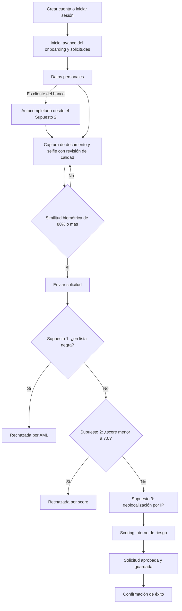
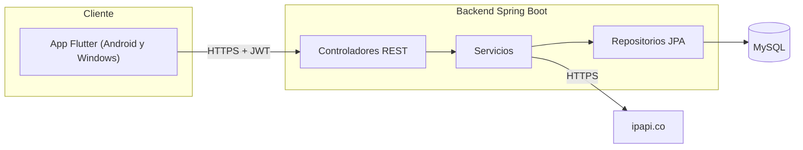
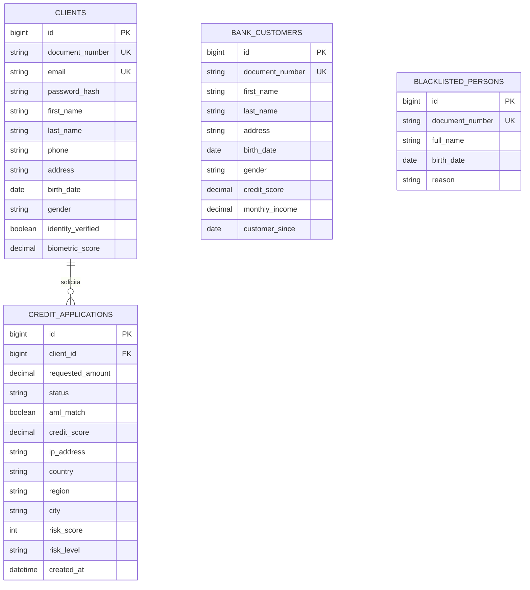

# Arquitectura funcional y técnica — FinanciaPlus

Este documento es el análisis escrito que pide la prueba. Describe cómo está construida la solución, por qué se tomó cada decisión y qué partes quedan diseñadas pero no programadas.

## 1. Resumen y alcance

FinanciaPlus necesita que clientes existentes y nuevos hagan el onboarding y soliciten una Cuenta Digital + Tarjeta de Débito sin ir a una sucursal. La solución tiene una app Flutter (Android y Windows) y un backend en Java que centraliza todas las validaciones.

El enunciado permite recortar el alcance. Esta tabla resume qué se programó, qué se simuló y qué queda solo documentado.

| Requisito | Estado | Detalle |
|---|---|---|
| Registro básico (nombre, dirección, fecha de nacimiento, género, documento, correo, teléfono) | Implementado | En dos momentos: registro de cuenta y datos personales del onboarding |
| Captura de documento (OCR) | Simulado | La app toma la foto y revisa su calidad; no se extrae texto |
| Selfie y prueba de vida | Simulado | La app toma la selfie y revisa su calidad; no hay detección de vida |
| Comparación biométrica (≥ 80%) | Simulado | El backend devuelve una similitud fija y aplica el umbral de 80% |
| Validación AML (Supuesto 1) | Implementado | API propia con consulta por documento y por nombre |
| Cliente del banco y autocompletado (Supuesto 2) | Implementado | API propia protegida con JWT |
| Score crediticio menor a 7.0 rechaza | Implementado | |
| Geolocalización por IP (Supuesto 3) | Implementado | ipapi.co, guardada dentro de la solicitud; no bloquea |
| Persistencia de la solicitud | Implementado | MySQL |
| Confirmación de éxito | Implementado | Pantalla de resultado |
| Guardar avances y continuar después | Implementado | El avance vive en la cuenta de la persona |
| Detectar documentos inválidos o repetidos | Implementado | Dígito verificador del DUI y unicidad de documento y correo |
| Nivel de riesgo con scoring interno | Implementado | Informativo; no decide la solicitud |
| Perfil económico, origen de fondos, comprobante de domicilio, firma digital | Documentado | Sección 7 |
| Tipo de tarjeta y límites | Parcial | Se pide el límite diario; el tipo de tarjeta queda documentado |

## 2. Arquitectura funcional

### 2.1 Flujo

### 2.2 Onboarding y originación

**Onboarding.** La persona crea una cuenta con sus datos mínimos (nombres, apellidos, DUI, teléfono, correo y contraseña). Después completa dirección, fecha de nacimiento y género, y verifica su identidad con una foto del documento y una selfie.

**Originación.** Con el onboarding completo, la persona envía la solicitud. En ese momento el backend ejecuta, en orden: validación AML, score crediticio, geolocalización y scoring de riesgo. El resultado queda guardado y visible en la pantalla de inicio.

### 2.3 Por qué hay cuentas con contraseña

El enunciado pide un proceso "completamente autónomo" y también "guardar avances y continuar en otro momento". Sin una cuenta no hay a qué volver, y sin identificar a la persona la API de clientes no se puede proteger de forma útil. Por eso cada persona tiene su cuenta y su sesión: el avance del onboarding vive en el servidor y se retoma desde cualquier dispositivo.

## 3. Arquitectura técnica

### 3.1 Capas

| Capa | Tecnología | Responsabilidad |
|---|---|---|
| Frontend | Flutter, Riverpod, go_router, Dio | Pantallas, navegación, captura de fotos y revisión de calidad |
| Backend | Java 21, Spring Boot 4, Spring Security, JPA | Reglas de negocio, autenticación, orquestación de validaciones |
| Datos | MySQL 8 | Cuentas, clientes del banco, lista negra y solicitudes |
| Servicios externos | ipapi.co | Geolocalización por IP |

### 3.2 Backend

Arquitectura en capas, organizada por tipo de componente:

| Paquete | Contenido |
|---|---|
| `controller` | Endpoints REST |
| `service` | Reglas de negocio. `CreditApplicationService` orquesta el flujo de la solicitud |
| `repository` | Acceso a datos con Spring Data JPA |
| `entity` | Modelo persistente |
| `dto` | Contratos de entrada y salida, con sus validaciones |
| `security` | Emisión y verificación del JWT |
| `validation` | Validación del DUI |
| `config` | Seguridad, Swagger, datos de demostración |
| `exception` | Manejo centralizado de errores |

Las tres APIs de los Supuestos se exponen como endpoints REST. Dentro del flujo de la solicitud, el backend usa esos mismos servicios en proceso, sin llamadas HTTP entre sí. Es un monolito modular: para una prueba es más simple de ejecutar y de revisar, y cada servicio (AML, clientes, geolocalización) tiene límites claros para separarlo más adelante si hiciera falta.

### 3.3 Frontend

Arquitectura limpia organizada por funcionalidad. Cada módulo (`authentication`, `onboarding`) tiene tres capas:

| Capa | Contenido |
|---|---|
| `domain` | Entidades y contratos de repositorios |
| `data` | Fuentes de datos (API y base local) e implementación de repositorios |
| `presentation` | Controladores de estado con Riverpod y pantallas |

`core` agrupa lo compartido: cliente HTTP, almacenamiento seguro, base local, validación del DUI y análisis de calidad de imagen.

## 4. Sesiones, seguridad y almacenamiento

### 4.1 Mecanismo elegido: JWT por persona

La API del Supuesto 2 se protege con **JWT firmado (HS256)**. Las razones:

- **Identifica a la persona, no solo a la app.** El token lleva el identificador del cliente. Con eso el backend comprueba que cada quien consulte únicamente sus propios datos: pedir el documento de otra persona devuelve 403. Una API key compartida por toda la app no permitiría esa restricción.
- **Sin estado en el servidor.** No hay tabla de sesiones ni memoria compartida; el backend puede escalar o reiniciarse sin cerrar sesiones.
- **Estándar.** Se integra con Spring Security y con cualquier cliente.

| Aspecto | Decisión |
|---|---|
| Contraseñas | Hash con BCrypt; nunca se guardan en texto claro |
| Duración del token | 60 minutos |
| Token vencido o ausente | Respuesta 401; la app cierra la sesión y vuelve al login |
| Almacenamiento en el dispositivo | `flutter_secure_storage` (Keystore en Android, credenciales protegidas en Windows) |
| Error de login | Mismo mensaje para correo inexistente y contraseña incorrecta, para no revelar qué cuentas existen |

### 4.2 Qué endpoints requieren autenticación

| Endpoints | Acceso | Motivo |
|---|---|---|
| Registro y login | Público | Son la puerta de entrada |
| Lista negra AML (Supuesto 1) | Público | El enunciado indica que no requiere autenticación |
| Clientes del banco y score (Supuesto 2) | JWT + documento propio | Exigido por el enunciado |
| Perfil, verificación de identidad y solicitudes | JWT | Operan sobre datos de la persona autenticada |

### 4.3 Secretos y configuración

Ninguna credencial está en el código ni en el repositorio. La contraseña de la base, la llave de firma del JWT y la contraseña de las cuentas de demostración se leen de variables de entorno: en local desde un archivo `.env` ignorado por git, y en producción desde la plataforma de despliegue. El backend no arranca si faltan.

### 4.4 Almacenamiento

| Dato | Dónde |
|---|---|
| Cuentas, perfil y resultado de la verificación | Tabla `clients` |
| Solicitudes con score, resultado AML, geolocalización y riesgo | Tabla `credit_applications` |
| Clientes existentes del banco | Tabla `bank_customers` |
| Lista negra | Tabla `blacklisted_persons` |
| Token de sesión | Almacenamiento seguro del dispositivo |
| Copia local de solicitudes creadas | SQLite en el dispositivo (Drift) |
| Fotos del documento y la selfie | Solo en el dispositivo; no se envían al backend |

### 4.5 Pendiente para producción

- Tokens de refresco y revocación de sesiones.
- Límite de intentos de login y de verificación de identidad.
- Verificación de correo o teléfono con código de un solo uso.
- Cifrado en reposo de datos personales y política de retención.
- Restringir el origen de la cabecera `X-Forwarded-For` a los proxies de confianza.

## 5. APIs de los Supuestos

### 5.1 Supuesto 1 — Lista negra (AML)

| Endpoint | Función |
|---|---|
| `GET /api/aml/check/{documento}` | Indica si el documento está en la lista |
| `GET /api/aml/search?name=` | Devuelve las personas cuyo nombre contiene el texto, con documento, fecha de nacimiento y motivo |

En el flujo de la solicitud, una persona coincide con la lista si coincide su documento, o si coinciden su nombre completo **y** su fecha de nacimiento. El nombre por sí solo no rechaza, para no bloquear a homónimos.

**Regla:** si hay coincidencia, la solicitud queda `REJECTED_AML` y el proceso termina.

### 5.2 Supuesto 2 — Cliente y score

| Endpoint | Función |
|---|---|
| `GET /api/bank-customers/{documento}` | Datos generales: nombre, dirección, fecha de nacimiento, género, correo, teléfono |
| `GET /api/bank-customers/{documento}/financial` | Datos financieros: score, ingreso mensual, fecha de alta |

Los datos generales se usan para autocompletar el formulario del onboarding cuando la persona ya es cliente.

**Regla:** si el score es menor a 7.0, la solicitud queda `REJECTED_CREDIT_SCORE`. Un score de exactamente 7.0 aprueba.

**Supuesto adoptado:** quien no es cliente del banco no tiene historial, así que recibe un score base de 7.50 y puede continuar. En un caso real ese score vendría de un buró de crédito.

### 5.3 Supuesto 3 — Geolocalización por IP

El backend consulta `https://ipapi.co/{ip}/json/` con la IP del dispositivo y guarda ip, país, región y ciudad **en la misma fila de la solicitud**, no en una tabla aparte.

**Regla:** no bloquea el proceso. Si el proveedor falla o no responde, la solicitud se aprueba igual y se guarda con la IP y sin ubicación.

La IP se obtiene de la conexión o, detrás de un proxy, de la cabecera `X-Forwarded-For`. En desarrollo local la IP es de loopback y no se puede geolocalizar, por lo que se sustituye por una IP pública configurable.

## 6. Integraciones

| Integración | Estado | Cómo se resolvería en producción |
|---|---|---|
| Lista negra AML | Real, API propia | Proveedor de listas (OFAC, ONU, listas locales) detrás de la misma interfaz |
| Cliente y score | Real, API propia | Core bancario y buró de crédito |
| Geolocalización | Real, ipapi.co | Proveedor con acuerdo de nivel de servicio |
| OCR del documento | Simulado | ML Kit en el dispositivo para leer el número de documento, o un servicio de verificación documental |
| Prueba de vida | Simulado | Proveedor especializado con detección pasiva |
| Comparación biométrica | Simulado | Servicio de comparación facial; el umbral de 80% ya está aplicado en el backend |

### 6.1 Puntos críticos y mitigación

El caso reporta fallas frecuentes en tres puntos. Así se abordan:

| Problema | Mitigación implementada | Mitigación propuesta |
|---|---|---|
| Fotos borrosas o con mala iluminación | Antes de aceptar una foto, la app mide el brillo y la nitidez y avisa si está oscura, sobreexpuesta o borrosa. La persona puede repetirla | Guía visual en la cámara (marco del documento) y captura automática cuando la imagen es nítida |
| OCR con errores en apellidos y fecha de nacimiento | No se depende del OCR: la persona escribe sus datos y, si es cliente, se autocompletan desde el banco | Mostrar lo leído por el OCR como sugerencia editable y contrastarlo con lo registrado; el número de documento se valida con su dígito verificador |
| Baja estabilidad en la prueba de vida | Tras una verificación fallida, la app limpia las capturas y permite reintentar | Límite de reintentos, y derivación a revisión manual o videollamada en lugar de bloquear |

La revisión de calidad se hace en el dispositivo, antes de enviar nada. Así el error se detecta en segundos y no después de una llamada lenta a un servicio externo, que es una de las causas de abandono que menciona el caso.

### 6.2 Integraciones lentas

El caso señala integraciones lentas con servicios externos. Las medidas aplicadas y propuestas:

- La única integración externa real (geolocalización) no bloquea: un fallo no detiene la solicitud.
- Las validaciones se ejecutan en una sola petición al backend, no en varias idas y vueltas desde la app.
- Propuesto: tiempos de espera cortos y reintentos acotados por proveedor, y ejecución asíncrona de las validaciones lentas con notificación al terminar.

## 7. Originación: campos documentados

El enunciado permite dejar estos elementos en el diseño sin programarlos. Así se incorporarían:

| Elemento | Diseño |
|---|---|
| Perfil económico | Paso adicional antes de enviar: ocupación, tipo de empleo, ingreso mensual y antigüedad laboral. Campos nuevos en la solicitud |
| Declaración de origen de fondos | Lista cerrada (salario, negocio propio, remesas, otros) con texto libre si es "otros", más una casilla de declaración jurada |
| Comprobante de domicilio | Carga de archivo (PDF o imagen, con límite de tamaño) a un almacenamiento de objetos; la solicitud guarda la referencia y la fecha. Reutiliza la captura y la revisión de calidad ya construidas |
| Tipo de tarjeta y límites | Selector de tarjeta (por ejemplo, clásica u oro) con límites máximos por tipo. Hoy solo se pide el límite diario |
| Firma digital de términos y condiciones | Casilla de aceptación explícita. Se guardan versión del documento, fecha y hora, IP y un hash del texto aceptado, como evidencia |

Estos pasos se añadirían entre el onboarding y el envío. Al guardarse en la cuenta, también se podrían retomar después.

## 8. Capacidades del sistema

| Capacidad pedida | Cómo se cumple |
|---|---|
| Guardar avances y continuar en otro momento | Los datos personales y la verificación de identidad se guardan en la cuenta. Al volver a entrar, el inicio muestra qué pasos faltan. Lo escrito en un formulario sin guardar no se conserva |
| Detectar documentos inválidos | El DUI se valida con formato y dígito verificador, en la app y en el backend |
| Detectar documentos repetidos | Documento y correo son únicos; un duplicado devuelve un error claro |
| Calcular el nivel de riesgo | Scoring interno, descrito abajo |
| Consultar el origen del cliente | Supuesto 3, durante la originación |
| Guardar la geolocalización con la solicitud | Columnas de la misma tabla `credit_applications` |
| Almacenar toda la información | MySQL |
| Confirmar el éxito | Pantalla de resultado con número de solicitud y ubicación detectada |

### 8.1 Scoring interno de riesgo

Suma puntos de riesgo a partir de señales que el flujo ya recoge. Se calcula para las solicitudes aprobadas y se guarda en la solicitud.

| Señal | Puntos |
|---|---|
| Score crediticio | 8.5 o más: 0 · 7.5 o más: 15 · menor: 30 |
| Relación con el banco | Cliente existente: 0 · nuevo: 20 |
| Similitud biométrica | 90% o más: 0 · menor: 10 |
| País de la IP | El Salvador: 0 · desconocido: 15 · otro país: 25 |

Menos de 30 puntos es riesgo bajo, menos de 60 es medio y 60 o más es alto.

El nivel es **informativo**: no aprueba ni rechaza. Las únicas reglas de rechazo son las del enunciado (lista negra y score). Sirve para priorizar revisiones posteriores o ajustar límites.

## 9. Eventos y logs

### 9.1 Registrados hoy

El backend escribe un log por cada decisión del flujo, con identificadores y sin datos personales:

| Evento | Datos |
|---|---|
| Verificación de identidad completada | Cliente, similitud, aprobado |
| Validación AML completada | Cliente, coincidencia |
| Consulta de score completada | Cliente, score |
| Geolocalización resuelta | Cliente, país |
| Geolocalización no disponible | Cliente, motivo |
| Scoring de riesgo completado | Cliente, puntos, nivel |
| Solicitud guardada | Solicitud, cliente, estado |
| Error no controlado | Traza completa |

### 9.2 Propuestos para producción

- **Bitácora de auditoría** en base de datos, inmutable, con cada cambio de estado de la solicitud y quién lo originó.
- **Eventos de seguridad:** inicios de sesión fallidos, accesos denegados (403) y tokens rechazados.
- **Identificador de correlación** por petición, para seguir una solicitud a través de todos los servicios.
- **Métricas de embudo:** abandono por paso (registro, captura, verificación, envío) y tiempo total hasta la aprobación, que son los dos problemas que motivan el proyecto.
- **Latencia y tasa de error por proveedor externo**, con alertas.
- Los logs no deben contener documentos, correos ni imágenes.

## 10. Modelo de datos

Estados de una solicitud: `APPROVED`, `REJECTED_AML` y `REJECTED_CREDIT_SCORE`.

`requested_amount` guarda el límite diario de transacciones solicitado para la tarjeta. `bank_customers` y `blacklisted_persons` simulan el core bancario y el proveedor de listas; no tienen relación directa con `clients` porque en un caso real serían sistemas externos.

## 11. Despliegue

| Componente | Plataforma |
|---|---|
| API | Render, a partir del `Dockerfile` de `backend/` |
| Base de datos | MySQL administrado en Aiven, con conexión cifrada |
| App | Compilada para Android (APK) y Windows |

La imagen se construye en dos etapas (compilación con Maven y ejecución solo con el JRE), corre con un usuario sin privilegios y limita la memoria de la JVM para caber en instancias de 512 MB.

Render termina la conexión HTTPS, así que el backend lee de las cabeceras del proxy el protocolo original y la IP real del dispositivo. Esa IP es la que se envía a ipapi.co.

## 12. Decisiones, limitaciones y siguientes pasos

### 12.1 Decisiones principales

| Decisión | Razón |
|---|---|
| Monolito modular en lugar de microservicios | Más simple de ejecutar y revisar; los servicios tienen límites claros para separarlos después |
| JWT por persona | Permite restringir cada consulta al titular de los datos |
| Validaciones en el backend | La app no es la única vía de entrada; ninguna regla depende solo del cliente |
| Geolocalización tolerante a fallos | Lo exige la regla de negocio y evita que un proveedor externo detenga la originación |
| Revisión de fotos en el dispositivo | Respuesta inmediata y menos abandono en el paso con más fricción |
| Flutter | Un mismo código para Android y Windows |

### 12.2 Limitaciones conocidas

- OCR, prueba de vida y comparación biométrica están simulados. El resultado de la verificación no depende de las fotos tomadas.
- Las fotos no se envían ni se almacenan en el backend.
- Los umbrales de luz y nitidez son valores iniciales; requieren calibración con capturas reales.
- No hay tokens de refresco: la sesión dura 60 minutos.
- El esquema de la base lo gestiona Hibernate automáticamente; en producción se usarían migraciones versionadas.
- Las pruebas automatizadas cubren el análisis de calidad de imagen. El flujo de la solicitud se verificó con pruebas manuales contra la API.
- El APK está firmado con la llave de depuración; no es apto para publicarse en una tienda.

### 12.3 Siguientes pasos

1. Integrar OCR y comparación facial reales, empezando por la lectura del número de documento.
2. Programar los pasos de originación de la sección 7.
3. Bitácora de auditoría y métricas de embudo.
4. Pruebas unitarias del flujo de la solicitud y pruebas de integración de la API.
5. Migraciones de base de datos versionadas y tokens de refresco.
